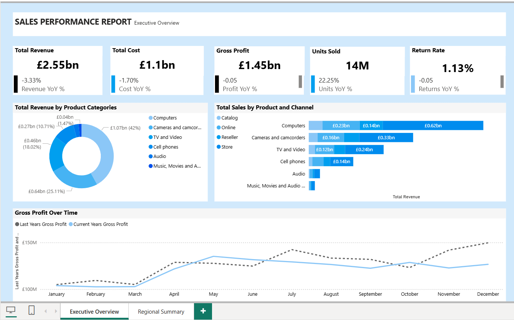
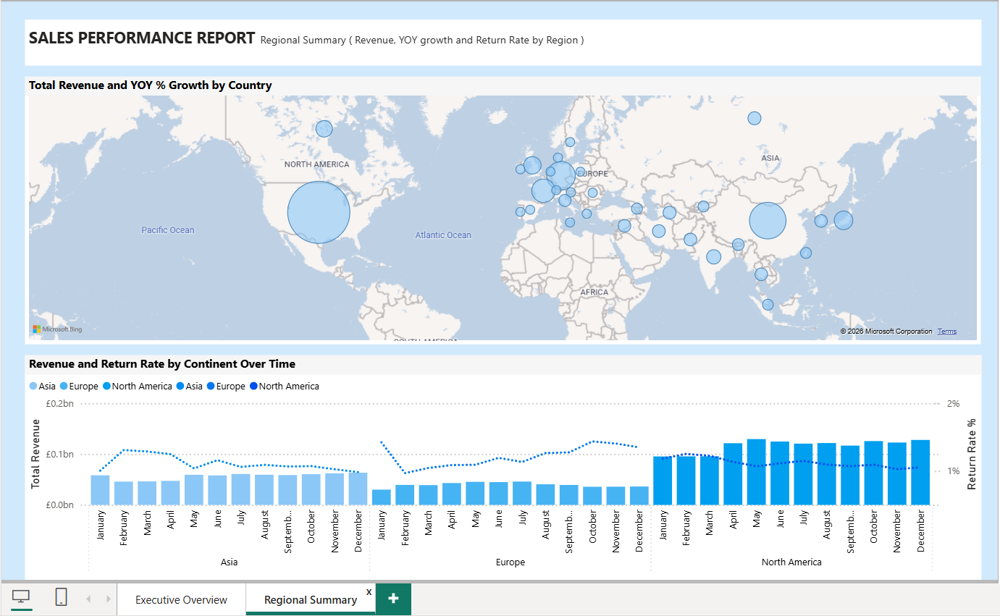

# Sales Performance – Executive Overview (Power BI)

## Overview
This project is an **executive-level sales performance dashboard** built in Power BI.
It provides a high-level view of commercial performance, focusing on revenue, cost,
profitability, volumes, and returns, with year-over-year (YoY) comparison.

The report is designed following **executive dashboard best practices**:
- No slicers on the Executive Overview
- Clear KPI cards with YoY indicators
- Geographic and product-level context
- Trend analysis vs last year

---

## Key KPIs
- **Total Revenue**
- **Total Cost**
- **Gross Profit**
- **Units Sold**
- **Return Rate**
- Year-over-Year (YoY) % change indicators

---

## Data Model
The report uses a **star schema** with a central fact table and supporting dimensions:

- **SalesFact** (fact)
- **Date**
- **Product**
- **Category**
- **Manufacturer**
- **Geo**
- **Sentiment**
- **Indicators / KPI helper tables**

A dedicated KPI table is used to organize all measures cleanly.

---

## Visuals Included
- Executive KPI cards with YoY comparison
- Revenue and YoY growth by country and product category (map)
- Sales and profit trends vs last year
- Product and channel performance breakdowns

---

## Tools & Technologies
- **Power BI Desktop**
- **DAX** (measures, time intelligence, YoY calculations)
- **Star schema data modeling**

---

## Screenshots

---

## Notes
- This report uses **sample / fictional data** for demonstration purposes.
- Due to file size limits, the PBIX file is not stored directly in the repository.
  It can be shared upon request or provided via GitHub Releases.

